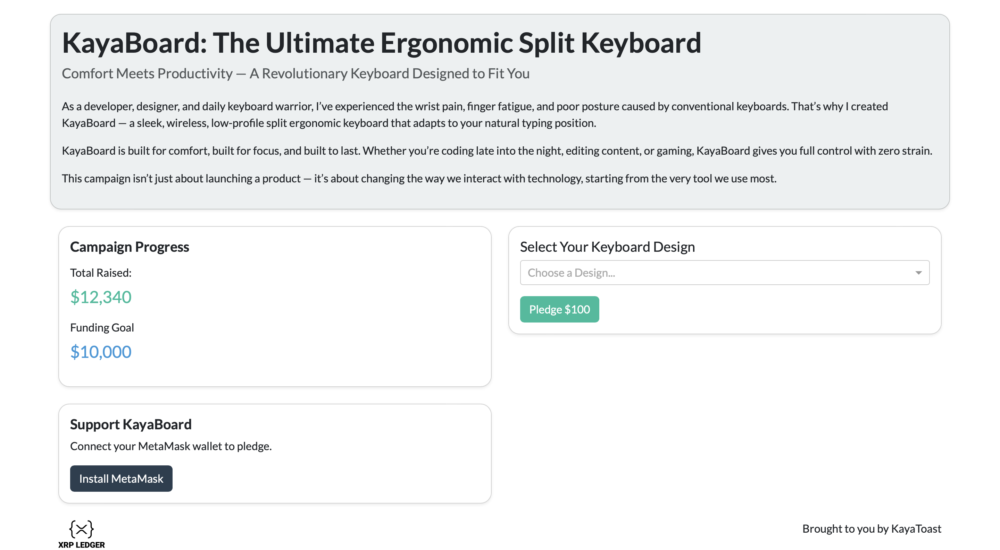

# 🚀 KayaToast — Kickstarter Platform on the XRPL EVM Sidechain

## 🔹 Summary

A decentralized Kickstarter-style platform using XRPL EVM Sidechain for crowdfunding, enhanced with multi-chain support through the Axelar Bridge.

Utilising the stable coin - RLUSD as the main exchange currency.



---

## 📖 Full Description

On KayaToast:

* Creators launch campaigns.
* Backers can pledge their support by connecting their MetaMask wallet and choosing their preferred currency.
* By leveraging multi-chain connectivity, we can deliver non-native assets from the respective blockchain networks to the XRPL EVM Sidechain.
* At the end of the campaign period, the accumulated funds are released to the creator.

Our platform empowers creators to launch crowdfunding campaigns that accept multi-chain crypto pledges. KayaToast leverages fast, flexible, low-cost transactions to provide users with a frictionless Web3 experience.

---

## 🛠 Technical Overview

### 🌐 Stack

* **Frontend:** Python (Flask, Plotly)
* **Backend:** Python (xrpl-py, web3)
* **Multi-Chain Connectivity:** XRP Ledger EVM Sidechain, Axelar Bridge
* **Smart Contracts:** Solidity
* **Wallet Integration:** MetaMask

### 🔀 Technical Flow

* Backer connects MetaMask wallet via our frontend built with Python's Plotly Dash and enhanced with JavaScript's MetaMask integration.
* Backer authorises the transaction on our frontend and we direct the payment to our `swappingpoll.sol`
* `swappingpoll.sol` accepts incoming assets, converts it to stable coin RLUSD (Uniswap) and directs it to `fundraiser.sol`


---


# Setup

1. Create a Python environment
2. Run this command: `chmod +x startup.sh`
3. Run the command below at the root of the project
    - upgrade pip
    - pip install requirements.txt to install required packages
    - install pre-commit that automatically format code with `black` and sort imports with `isort` with every commit
    - installs postgres version 16 and add the executables to PATH

```bash
./startup.sh
```
